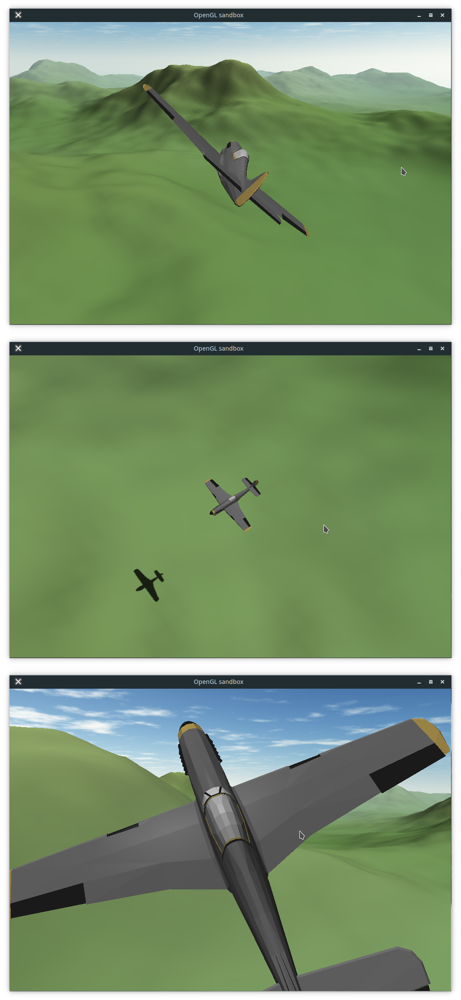

Fly
=====




A simple flight simulator in C++11/OpenGL.

Features a procedurally generated infinite terrain over which you can fly around.
With *explosions*!


Controls:
-----------
WASD or Arrow keys to change the plane's direction.
Click anywhere on the screen and move the mouse to rotate the camera, and scroll to change zoom.


Command line arguments:
-----------------------------
```
usage: Fly [options...]

-h   | --help        Print this help text and exit
-w X | wX            Set window width to X (default: 1024)
-H Y | HY            Set window height to Y (default: 720)
-s Z | sZ            Set seed to Z (default: random seed)
-f   | --fullscreen  Set fullscreen mode (default: false)
--wireframe          Render in wireframe mode (default: false)
--plane-box          Draw a bounding box around the plane (default: false)
```

YouTube Playlist:
------------------
[Link to YouTube Playlist](https://www.youtube.com/playlist?list=PLiULt7qySWt20wzP_o6aeUNaClIziR0TR)


Compiling
-----------

You need:
* SFML 2.1+ development headers and library
* C++11 compliant compiler
* CMake 3.11+
* GLEW

Once you have the dependencies, run cmake on the source directory, if the dependencies aren't in a standard path, you may have to specify their paths.
e.g., on Linux/OS X/FreeBSD:
```
$ git clone https://github.com/amhndu/Fly
$ cd Fly
$ mkdir build/ && cd build/
$ cmake ..
$ make -j4
```
On Windows, you might find `cmake-gui` useful, set the build and source directories, run configure. If dependencies weren't found, add their paths in the gui, then generate makefiles/Visual Studion solution to compile.


Contact:
--------------------
amhndu ..at.. gmail
